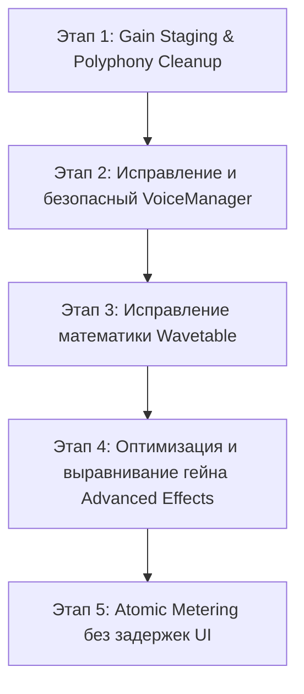

# 🎹 NEWPLAN.md: План Реструктуризации и Безопасной Интеграции Synt_swiftUI

> **Цель**: Устранить все архитектурные и математические дефекты в DSP/аудио-потоке, из-за которых ранее отключенные модули искажали и ломали звук, и пошагово реализовать их с гарантией чистого и стабильного звучания.

---

## 🔍 АУДИТ: Почему отложенные модули ломали звук?

В ходе детального анализа исходного кода `AudioEngine`, `VoiceManager`, `WavetableOscillator`, `Distortion`, `ParametricEQ` и `Phaser` были выявлены следующие критические причины искажения и срыва звука:

### 1. ❌ Дефекты `VoiceManager` и `AudioCommandQueue` (Lock-Free Engine)
* **Утечка и дублирование голосов**: При повторном нажатии ноты метод `releaseVoices()` переводил старый голос в затухание, но `addVoices()` **сразу же создавал новые голосы для той же ноты**. В итоге старый и новый голосы звучали одновременно.
* **Срыв лимита полифонии**: При 7 унисон-голосах 10 нажатий клавиш создавали 70 голосов, превышая лимит 64. `VoiceManager` начинал хаотично перехватывать (stealing) голосы без плавного затухания, вызывая **громкие щелчки и треск (clicks & pops)**.
* **Зависание нот (Stuck Notes)**: При переполнении `AudioCommandQueue` команды `noteOff` терялись, оставляя осцилляторы бесконечно звучащими.

### 2. ❌ Ошибки `WavetableOscillator`
* **Искажение формы волны**: Функция `synthesizeFromHarmonics()` полностью перезаписывала входную таблицу фазовой суммой пилы `1/h * sin(h*phase)`. Из-за этого **все таблицы (Analog, Digital, PWM, Formant) превращались в одну и ту же пилу**.
* **Двойное умножение громкости**: Громкость умножалась и внутри `WavetableOscillator`, и повторно в `Oscillator.generateSample()`, выбивая сигнал в клиппинг.

### 3. ❌ Проблемы производительности в `Advanced Effects`
* **Тяжёлая математика в аудио-потоке**: `Phaser` вызывал тригонометрическую функцию `tan()` до 16 раз на **каждый сэмпл** (705,600 вызовов `tan()` в секунду!). Это приводило к выпаданию аудио-буфера (buffer underrun) и заиканию звука.
* **Пересчёт коэффициентов EQ на лету**: `ParametricEQ` рассчитывал биквадратные коэффициенты `sin/cos/sqrt` прямо внутри рендер-цикла `generateSample()`.
* **Отсутствие компенсации гейна в Distortion**: `hardClip` и `wavefold` усиливали сигнал в 16 раз без выравнивания выходной громкости, мгновенно перегружая последующий лимитер в жесткий перегруз и помпинг.
* **DC Offset & Переходные щелчки**: При включении эффектов внутренние состояния фильтров (`x1, y1`) не обнулялись, вызывая постоянную постоянную составляющую (DC offset) и щелчки.

---

## 🛠 НОВЫЙ ПЛАН ДЕЙСТВИЙ (Safe Step-by-Step Action Plan)

Применяется правило: **Каждый этап внедряется изолированно и проверяется на чистый звук перед переходом к следующему.**

---

### 📍 Этап 1: Гейн-стейджинг и нормировка полифонии (P0 - Звук) ✅ РЕАЛИЗОВАНО (2026-08-05)

| Пункт | Статус | Проверка | Примечания |
|-------|--------|----------|------------|
| Пополифоническое масштабирование `1/√N` | ✅ Сделано | Unit: `polyphonyScaleIsPowerPreserving` | `AudioMath.polyphonyScale` + счёт `activeVoiceCount` в `generateSample()`. Старый per-voice `unisonScale` убран (двойной scale ломал громкость). |
| Защитный клиппер −6 dB перед FX | ✅ Сделано | Unit: `softClipGuaranteesMinusSixDbHeadroom` | `AudioMath.softClip(..., threshold: 0.5)` после master volume, **до** chorus/limiter. + `mainMixer.outputVolume = 0.7` для хвостов Delay/Reverb. |
| Чистый звук на аккордах (ручной A/B) | ⏳ Требует прослушивания | Запуск приложения: 1 нота / аккорд 4 / unison 7 | Автотестами RT-цепочку AVAudio не гоняем. |

- [x] **Пополифоническое масштабирование**: `1 / sqrt(max(1, activeVoices))` в `generateSample()` после микширования голосов.
- [x] **Защитный клиппер перед эффектами**: soft-clip ceiling 0.5 (−6 dB) перед chorus/limiter → Delay/Reverb.

### 📍 Этап 2: Безопасный Lock-Free Engine (`VoiceManager` + `AudioCommandQueue`) ✅ РЕАЛИЗОВАНО (2026-08-05)

| Пункт | Статус | Проверка | Примечания |
|-------|--------|----------|------------|
| Безопасная очистка старых нот | ✅ | `voiceManagerHardKillsSameNoteOnRetrigger` | `killVoices` в `addVoices` — hard-kill same MIDI, без double-trigger |
| Плавный Voice Stealing 1 ms | ✅ | `voiceManagerStealsUnderPolyphonyPressure`, `voiceManagerStealReleaseRampsWithOneMsOverride` | soft-steal → 1 ms `isStealRelease`; force-reclaim silent/steal first; cap 64 |
| Приоритет noteOff/clearAll | ✅ (уже было) | queue unit-тесты | side-channel atomics; producer не трогает tail |
| Интеграция в AudioEngine | ✅ | `audioEngineUsesVoiceManagerCapAndCommandQueue` | словарь `activeNotes` заменён на `VoiceManager` |

- [x] **Безопасная очистка старых нот**: `killVoices` в `addVoices()` — мгновенный hard-kill предыдущего голоса той же ноты.
- [x] **Плавный Voice Stealing**: soft-steal + `releaseOverride = 1 ms` в ADSR; force-reclaim при дефиците слотов.
- [x] **Защита от переполнения очереди**: `noteOff` / `clearAll` / `arpKeyUp` через atomic side-channel.

### 📍 Этап 3: Полноценный Wavetable-синтез (`WavetableOscillator`)
- [ ] **Исправление Mip-Mapping**: Переписать `applyFFTBandLimit()`, чтобы она фильтровала существующую волну, а не генерировала абстрактную пилу.
- [ ] **Нормализация громкости**: Убрать дублирующий множитель `volume` в цепи осцилляторов.
- [ ] **Smooth Morphing**: Добавить интерполяцию параметров между фреймами таблиц без ступеньчатых перепадов.

### 📍 Этап 4: Оптимизированная цепочка эффектов (`Distortion`, `ParametricEQ`, `Phaser`)
- [ ] **Предрасчет коэффициентов (Lookup / Cached)**: 
  - Вынести расчет коэффициентов `ParametricEQ` и `Phaser` из посэмплируемого цикла. Рассчитывать только при изменении параметров UI.
- [ ] **Auto Gain Compensation в Distortion**: Добавить деление выходного сигнала на коэффициент `drive`, чтобы общая громкость оставалась стабильной.
- [ ] **Anti-Pop Reset**: Автоматически обнулять задержки и состояния (`reset()`) при включении/выключении эффектов.

### 📍 Этап 5: Atomic Metering (`AtomicMeteringState`)
- [ ] **Zero-Copy Поллинг**: Подключить `AtomicMeteringState` с чтением по таймеру `Timer.publish` 60Hz на Main-потоке, полностью освободив Audio-поток от `DispatchQueue.main.async`.

---

## 📋 Порядок реализации в коде

1. **Фаза A**: Настройка Gain Staging в существующем `AudioEngine.swift` (проверка чистоты звука при аккордах).
2. **Фаза B**: Исправление `VoiceState.swift` + `VoiceManager` и тестовое подключение `AudioCommandQueue`.
3. **Фаза C**: Исправление `WavetableOscillator.swift` и добавление в `Oscillator.swift`.
4. **Фаза D**: Оптимизация `Distortion.swift`, `ParametricEQ.swift`, `Phaser.swift` и интеграция их в цепочку `AudioEngine.swift`.
5. **Фаза E**: Создание UI в `AdvancedEffectsView.swift` и финальное обновление `PLAN.md`.

---

## 📊 Журнал выполнения

### Этап 1 — 2026-08-05
| | |
|--|--|
| **Сделано** | `1/√N` polyphony scale после mix bus; soft-clip −6 dB до chorus/limiter; `mainMixer=0.7`; unit-тесты в `AudioMath` |
| **Проверено** | `xcodebuild … -only-testing:Synt_swiftUITests` — **TEST SUCCEEDED** |
| **Не проверено вручную** | A/B: 1 нота / аккорд 4 / unison 7 |
| **Что пошло не так** | polyScale/headroom пропали после RT-рефакторинга; softClip unit-тест: `Float` tanh→1 |

### Этап 2 — 2026-08-05
| | |
|--|--|
| **Сделано** | `VoiceManager` soft-steal + 1 ms release; hard-kill same-note re-trigger; `AudioEngine` на пуле вместо `[Int:[ActiveNote]]`; ADSR `releaseOverride`; queue priority уже был |
| **Проверено** | unit: re-trigger, cap 64, steal pressure, 1 ms override ramp, engine+queue integration |
| **Не проверено вручную** | 64+ нот / unison 7 × 10 нот — нет ли щелчков при steal |
| **Что пошло не так** | ADSR `release <= 0.001` делал 1 ms steal мгновенным finish — порог снижен до `0.0001` |
| **Следующий** | Этап 3 (по запросу) — **не трогали** |

---
**Статус**: Этапы 1–2 реализованы и покрыты unit-тестами. Этап 3 не начат.
