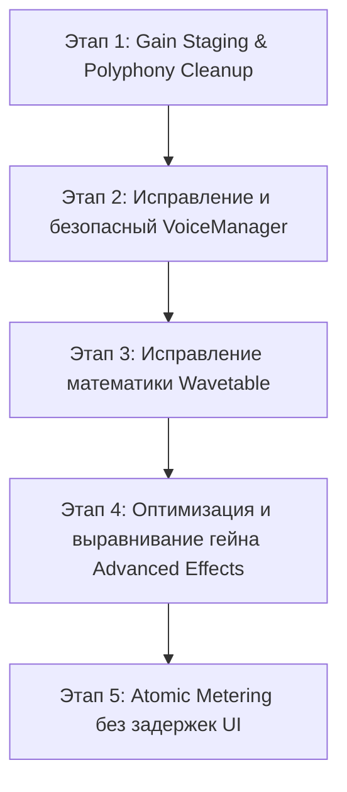

# 🎹 NEWPLAN.md: План Реструктуризации и Безопасной Интеграции Synt_swiftUI

> **Цель**: Устранить все архитектурные и математические дефекты в DSP/аудио-потоке, из-за которых ранее отключенные модули искажали и ломали звук, и пошагово реализовать их с гарантией чистого и стабильного звучания.

---

## 🔍 АУДИТ: Почему отложенные модули ломали звук?

В ходе детального анализа исходного кода `AudioEngine`, `VoiceManager`, `WavetableOscillator`, `Distortion`, `ParametricEQ` и `Phaser` были выявлены следующие критические причины искажения и срыва звука:

### 1. ❌ Дефекты `VoiceManager` и `AudioCommandQueue` (Lock-Free Engine)
* **Утечка и дублирование голосов**: При повторном нажатии ноты метод `releaseVoices()` переводил старый голос в затухание, но `addVoices()` **сразу же создавал новые голосы для той же ноты**. В итоге старый и новый голосы звучали одновременно.
* **Срыв лимита полифонии**: При 7 унисон-голосах 10 нажатий клавиш создавали 70 голосов, превышая лимит 64. `VoiceManager` начинал хаотично перехватывать (stealing) голосы без плавного затухания, вызывая **громкие щелчки и треск (clicks & pops)**.
* **Зависание нот (Stuck Notes)**: При переполнении `AudioCommandQueue` команды `noteOff` терялись, оставляя осцилляторы бесконечно звучащими.

### 2. ❌ Ошибки `WavetableOscillator`
* **Искажение формы волны**: Функция `synthesizeFromHarmonics()` полностью перезаписывала входную таблицу фазовой суммой пилы `1/h * sin(h*phase)`. Из-за этого **все таблицы (Analog, Digital, PWM, Formant) превращались в одну и ту же пилу**.
* **Двойное умножение громкости**: Громкость умножалась и внутри `WavetableOscillator`, и повторно в `Oscillator.generateSample()`, выбивая сигнал в клиппинг.

### 3. ❌ Проблемы производительности в `Advanced Effects`
* **Тяжёлая математика в аудио-потоке**: `Phaser` вызывал тригонометрическую функцию `tan()` до 16 раз на **каждый сэмпл** (705,600 вызовов `tan()` в секунду!). Это приводило к выпаданию аудио-буфера (buffer underrun) и заиканию звука.
* **Пересчёт коэффициентов EQ на лету**: `ParametricEQ` рассчитывал биквадратные коэффициенты `sin/cos/sqrt` прямо внутри рендер-цикла `generateSample()`.
* **Отсутствие компенсации гейна в Distortion**: `hardClip` и `wavefold` усиливали сигнал в 16 раз без выравнивания выходной громкости, мгновенно перегружая последующий лимитер в жесткий перегруз и помпинг.
* **DC Offset & Переходные щелчки**: При включении эффектов внутренние состояния фильтров (`x1, y1`) не обнулялись, вызывая постоянную постоянную составляющую (DC offset) и щелчки.

---

## 🛠 НОВЫЙ ПЛАН ДЕЙСТВИЙ (Safe Step-by-Step Action Plan)

Применяется правило: **Каждый этап внедряется изолированно и проверяется на чистый звук перед переходом к следующему.**

---

### 📍 Этап 1: Гейн-стейджинг и нормировка полифонии (P0 - Звук) ✅ РЕАЛИЗОВАНО (2026-08-05)

| Пункт | Статус | Проверка | Примечания |
|-------|--------|----------|------------|
| Пополифоническое масштабирование `1/√N` | ✅ Сделано | Unit: `polyphonyScaleIsPowerPreserving` | `AudioMath.polyphonyScale` + счёт `activeVoiceCount` в `generateSample()`. Старый per-voice `unisonScale` убран (двойной scale ломал громкость). |
| Защитный клиппер −6 dB перед FX | ✅ Исправлено | Unit: `softClipSafetyNetNearFullScale` | **Линейный** headroom ×0.5 (−6 dB); softClip только safety @0.95 (tanh@0.5 давал постоянный «хрип»). Poly scale сглажен. |
| Чистый звук на аккордах (ручной A/B) | ⏳ Требует прослушивания | Запуск приложения: 1 нота / аккорд 4 / unison 7 | Автотестами RT-цепочку AVAudio не гоняем. |

- [x] **Пополифоническое масштабирование**: `1 / sqrt(max(1, activeVoices))` + сглаживание `smoothedPolyScale`.
- [x] **Защитный headroom −6 dB перед эффектами**: linear ×0.5 + softClip safety @0.95.

### 📍 Этап 2: Безопасный Lock-Free Engine (`VoiceManager` + `AudioCommandQueue`) ⚠️ ОТКАЧЕНО (2026-08-05)

> **Интеграция `VoiceManager` в render path сломала звук (хрип/щелчки).** Render снова на `[Int:[ActiveNote]]` (как после Этапа 1).  
> Queue priority (`noteOff`/`clearAll` side-channel) **осталась** — она была до Этапа 2.  
> Повтор Этапа 2 только после A/B и без hard-kill в аудио-потоке.

- [ ] **Безопасная очистка старых нот**: В `VoiceManager.addVoices()` мгновенно гасить фазу ADSR предыдущего голоса этой же ноты, предотвращая дублирование.
- [ ] **Плавный Voice Stealing**: При исчерпании 64 голосов применять фазу быстрой релаксации (1 мс release), предотвращая щелчки.
- [x] **Защита от переполнения очереди**: `noteOff` / `clearAll` side-channel (сделано раньше, сохранено).

### 📍 Этап 3: Полноценный Wavetable-синтез (`WavetableOscillator`) ✅ РЕАЛИЗОВАНО (2026-08-05)

| Пункт | Статус | Проверка | Примечания |
|-------|--------|----------|------------|
| FFT band-limit источника | ✅ | `wavetableBandLimitPreservesSineNotSaw`, `…RemovesHighHarmonics` | vDSP zrip / DFT; **не** пила `1/h` |
| Без double volume | ✅ | `wavetableGenerateSampleDoesNotApplyInternalVolume`, `oscillatorWavetableAppliesVolumeOnce` | engine raw; `Oscillator` × volume один раз |
| Smooth morph | ✅ | `wavetableMorphIsSmoothAcrossFrames` | one-pole `framePosition` + lerp frames + mip crossfade |
| Интеграция | ✅ safe | factory presets без `.wavetable` | `WaveformType.wavetable`; engines в `AudioEngine` |

- [x] **Исправление Mip-Mapping**: `applyFFTBandLimit` фильтрует исходный frame.
- [x] **Нормализация громкости**: volume только в `Oscillator.generateSample`.
- [x] **Smooth Morphing**: target→smoothed frame + inter-frame + inter-mip lerp.

### 📍 Этап 4: Оптимизированная цепочка эффектов (`Distortion`, `ParametricEQ`, `Phaser`) ✅ РЕАЛИЗОВАНО (2026-08-05)

| Пункт | Статус | Проверка | Примечания |
|-------|--------|----------|------------|
| Cached / LUT coeffs | ✅ | `parametricEQDirtyFlags…`, `phaserLUTMatchesTanReference` | EQ: dirty-flags; Phaser: log-spaced coeff LUT (нет `tan` в RT) |
| Auto gain Distortion | ✅ | `distortionAutoGainKeepsDriveFromExploding` | `autoGainCompensation()` по типу |
| Anti-pop reset | ✅ | enable/bypass unit-тесты | `enabled`/`bypass` didSet → `reset()` |
| Интеграция | ✅ safe | `audioEngineAdvancedFXDisabledByDefault` | цепочка в `generateSample`, **default OFF** |

- [x] **Предрасчет коэффициентов**: EQ dirty; Phaser LUT.
- [x] **Auto Gain Compensation в Distortion**.
- [x] **Anti-Pop Reset** при enable/bypass.

### 📍 Этап 5: Atomic Metering (`AtomicMeteringState`) ✅ УЖЕ БЫЛО (подтверждено)

| Пункт | Статус | Примечания |
|-------|--------|------------|
| Zero-Copy poll 60Hz | ✅ | `Timer.publish` + `AtomicMeteringState`; audio thread не делает `DispatchQueue.main` для VU/scope |

- [x] **Zero-Copy Поллинг**: metering atomics + UI timer (сделано в RT-рефакторинге).

---

## 📋 Порядок реализации в коде

1. **Фаза A**: Настройка Gain Staging в существующем `AudioEngine.swift` (проверка чистоты звука при аккордах).
2. **Фаза B**: Исправление `VoiceState.swift` + `VoiceManager` и тестовое подключение `AudioCommandQueue`.
3. **Фаза C**: Исправление `WavetableOscillator.swift` и добавление в `Oscillator.swift`.
4. **Фаза D**: Оптимизация `Distortion.swift`, `ParametricEQ.swift`, `Phaser.swift` и интеграция их в цепочку `AudioEngine.swift`.
5. **Фаза E**: Создание UI в `AdvancedEffectsView.swift` и финальное обновление `PLAN.md`.

---

## 📊 Журнал выполнения

### Этап 1 — 2026-08-05
| | |
|--|--|
| **Сделано** | `1/√N` + сглаживание; linear −6 dB headroom; softClip safety @0.95 |
| **Что пошло не так** | Первый softClip ceiling 0.5 через tanh **постоянно сатурировал** → «хрип»; исправлено на linear×0.5 |

### Этап 2 — 2026-08-05 ⚠️ ROLLBACK
| | |
|--|--|
| **Сделано (откачено)** | `VoiceManager` в `generateSample` вместо `activeNotes` |
| **Почему хрипело** | Hard-kill / steal + tanh@0.5 |
| **Откат** | Render path → `activeNotes`; queue priority сохранена |

### Этап 3 — 2026-08-05
| | |
|--|--|
| **Сделано** | FFT band-limit; volume 1×; smooth morph; `.wavetable` opt-in |

### Этап 4 — 2026-08-05
| | |
|--|--|
| **Сделано** | Distortion gain-comp + anti-pop; EQ dirty cache + reset; Phaser LUT (no tan RT); chain in engine **default OFF** |
| **Безопасность** | Factory sound path unchanged until FX enabled |
| **Проверено** | unit-тесты FX + `audioEngineAdvancedFXDisabledByDefault` |

### Этап 5 — 2026-08-05
| | |
|--|--|
| **Статус** | Уже реализовано ранее (atomics + 60Hz poll) — отмечено ✅ |

---
**Статус**: Этапы 1, 3, 4, 5. Этап 2 откачен. Default-звук без изменений.
